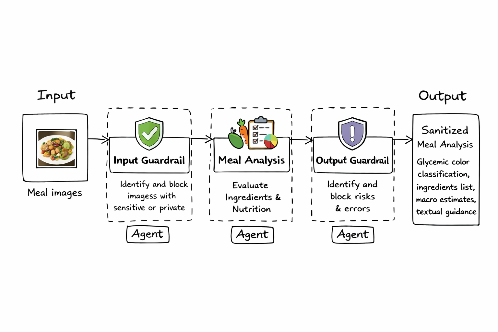

# Meal Analysis README

## Goal and Summary

- This project is intended to look for the best performing models based on evaluation scores, recommend an architecture to the client, and highlight any warnings and limitations of the evidence and conclusions.
- If you’re looking for a condensed summary of the project findings, please look at `evaluation_results.ipynb` at the project root

## Eval Platform Chosen

**I chose to write a custom evaluation harness in Python** because:

1. I considered the EleutherAI harness. But it is originally intended for static NLP tasks, not a **testing framework** capable of validating and enforcing structured JSON schemas, or managing multi-step guardrail logic. And I would have to do additional configuration to overcome these hurdles, making it a less practical option.
2. I considered Promptfoo because it can handle Vision-to-JSON validation, but due to time constraints (I need more time to become familiar with the framework), it’s simpler to just use a custom harness.

## Setup Instructions

- Step 0 - install dependencies, and start a conda environment
`conda env create -f environment.yml`
`conda activate healthevals`
- Step 1
Run evaluations (have models take the test and save answers to `outputs/results.csv`)
`python evals/run_evals.py`  *This may take a while…*

Inside `agent_models.yaml`, we see which models will be evaluated.
*Some models have usage, quota, or API restrictions, so if you change the model, the following scripts may not be able to run. You can leave this file as is.*

Alternatively for testing, you can run a few samples (take parts of the test), e.g., 10 samples for each (agent, model) tuple, such as below:
`python evals/run_evals.py --num-samples 10`
- Step 2
Score evals (compare the answers against the test answer key, and output overall scores in `results_scored.csv` and `agent_model_summary.csv`)
`python score_evals.py`

### Output Files

- `results.csv` : For each agent, we pick a model and generate an answer, where all answers from each evaluation job are stored in the CSV.
- `results_scored.csv` : The results/answers from each agent are now compared against the ground truth. Here we have row-level detail (best for debugging/plots/further analysis)
- `agent_model_summary.csv`: grouped rollup (best for quick human reading/reporting), grouped by (agent, model) to compare performances between each model

## Architecture Diagram

> Linear stages — one agent after another
>

**Agent 1: Input Guardrail (The Bouncer)**
Runs first. If sensitive data is detected from the image (e.g., PII, a human, etc.), the process stops immediately. Prevents sensitive data from ever being processed by following models.

**Agent 2: Meal Analysis (The Analyst)**
Only if the image passes Agent 1, Agent 2 performs the heavy lifting and infers: macros, ingredients, and glycemic color.

**Agent 3: Output Guardrail (The Auditor)**
Reviews the text generated by the Analyst. If it detects a medical diagnosis or risky treatment advice, it redacts the message before the user sees it.

Rationale for linear architecture, or linear pipeline:

- **Liability Mitigation:** By placing Safety and Guardrails as sequential blockers, hallucinations or liabilities are caught before they reach the user
- **Cost Efficiency:** Running a lightweight model (like a "mini" or "nano" variant) for the Input Guardrail discards 100% of "bad" requests early, saving the token costs of running the larger Inference model on invalid data
- **Operational Integrity:** This setup allows you to set up Agents 1 and 3 like an entrance and exit gate, while allowing for continuous optimization of accuracy on Agent 2
- **Independent Scaling:** If we notice agent bottlenecks in one stage of the pipeline, we can independently scale or allocate more resources to one step of the pipeline.

Alternate considerations for the future:

- Running agents 1 and 2 in parallel to reduce end-to-end user latency. However, this creates significant complexity in coordinating asynchronous architecture, which is an additional cost and complexity.

## Selected Models

Based on the evaluation scores:

1. For inputGuardrails → **gpt-4.1-mini** performed better
Higher eval score, less latency
2. For mealAnalysis → **gpt-4.1** performed better
Higher eval score, less latency
3. For outputGuardrails → **gpt-4.1-nano** performed better
Higher eval score, less latency

> Warnings: 
1. **This is an interim recommendation.** 
For mealAnalysis, gpt-4.1 performed better than gpt-5-mini, but the composite mealAnalysis scores for both aren’t high, which may not fulfill the client’s needs. The mealAnalysis score is mainly dragged down by ingredient-level matching quality, which suggests that based on food images, the models have a hard time identifying the ingredients.
**Further research needs to be done to see if heavier-weight models (besides gpt-5-mini) score better.**

2. **mealAnalysis is likely the most meaningful evaluation here.** 
The ground truth for inputGuardrails and outputGuardrails are missing or noisy, so these evaluation scores are largely incomplete. Please see below for more details on why that is.
> 

## Future improvements on scripts

> If I had more time, what I’d do is…
> 
- Unit tests, integration tests, mock different failure scenarios (e.g., reading missing ground truths), malformed ground truths, failed network requests, etc.
- More OOD design, separation of logic, classes, and files
- I would run the evaluation jobs in parallel, and grading against ground truth in parallel as well
